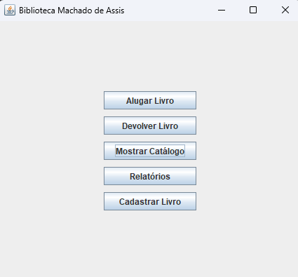
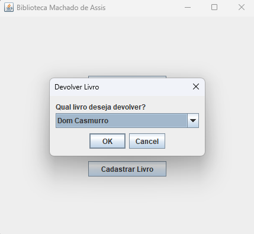

# Sistema de biblioteca (java)

Sistema de gerenciamento de biblioteca desenvolvido em Java, com foco em organização de acervo e controle de empréstimos.

## Funcionalidades
- Cadastro e gerenciamento de livros
- Registro e controle de usuários
- Sistema de empréstimos e devoluções
- Listagem e organização do acervo

## Tecnologias
- Java
- Programação Orientada a Objetos (POO)

## Conceitos aplicados
- Encapsulamento
- Herança e polimorfismo
- Separação de responsabilidades entre classes
- Manipulação de coleções

## Objetivo
Aplicar conceitos de programação orientada a objetos na construção de um sistema organizado e funcional para gerenciamento de biblioteca.

## Execução
1. Baixe a paste de arquivo no formato .zip
2. Extraia o .zip instalado
3. Execute o Login.java

## Contexto
Projeto acadêmico desenvolvido no IFRN em trabalho colaborativo.

--

# Preview

